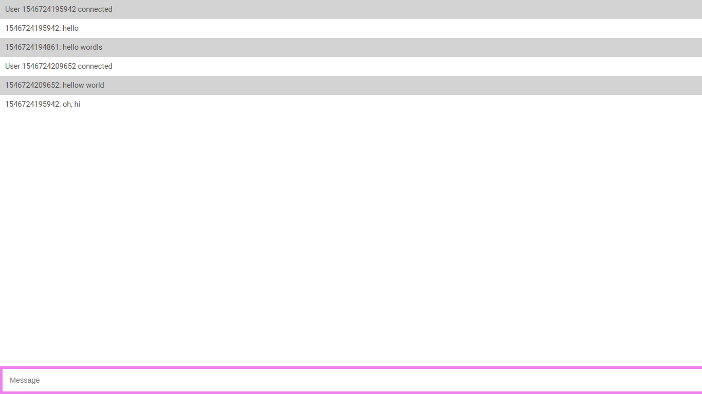

# Demo-Chat
by [@mazurdev](https://twitter.com/mazurdev)



## Stack

* JavaScript
* Vue
* Socket.io
* Express

## Getting started
```bash
git remote add origin https://github.com/mazurdev/mini-chat.git
cd demo-chat
npm install | yarn
node ./server.js

go to http://localhost:3000 and write a message
again go to http://localhost:3000 in the second tab and write a new message
```
